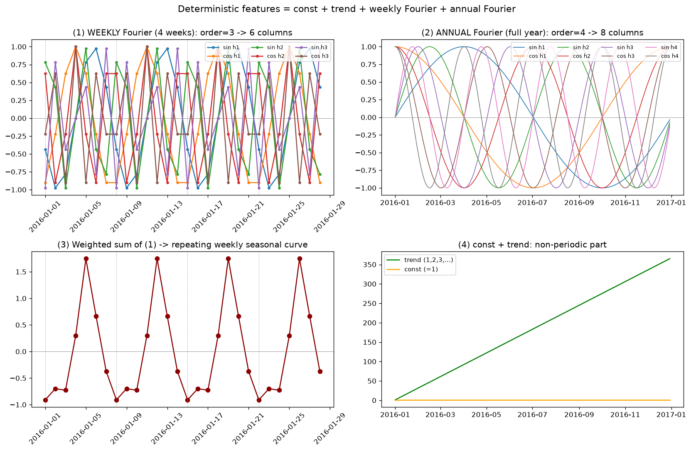

# Deterministic — Trend + Fourier result (notebook `03_deterministic.ipynb`)

**Scope:** what the deterministic stage actually produced — the first *learned* model's
validation score, how it compares to the baseline floor, and the two data traps building it
exposed. This is
the result page; the *idea* of trend + Fourier seasonality lives in
[`../concepts/seasonality-fourier.md`](../concepts/seasonality-fourier.md).

---

## What the notebook does

The same thin-notebook shape as the baseline — all logic in `src/`:

1. **Load + reindex** — `train.csv` onto a gap-free daily calendar (closed days → `sales = 0`).
   Doubly important here: Fourier terms are computed from each row's calendar *position*, so a
   missing day would slide the weekly/annual waves out of phase. See
   [`../data-traps/01-missing-calendar-days.md`](../data-traps/01-missing-calendar-days.md).
2. **Validation split** — the *same* last 16 days (2017-07-31 → 2017-08-15) the baseline used. See
   [`../concepts/validation.md`](../concepts/validation.md).
3. **Build deterministic features** — `make_deterministic_features` produces a 16-column,
   date-only table over the full **train ∪ horizon** index (so the `trend` counter is continuous):
   `const`, `trend`, 3 weekly Fourier harmonics, 4 annual Fourier harmonics. See
   [`../concepts/seasonality-fourier.md`](../concepts/seasonality-fourier.md).
4. **Fit + predict** — a **separate `LinearRegression` per series**, in `log1p` space (inverted
   with `expm1`, clipped to `>= 0`). Each series learns its own level, trend slope, and seasonal
   amplitude.
5. **Score + log** — RMSLE on the validation set, then append to `iteration_log.md`.

The logic is in `src/features.py` (`make_deterministic_features`) and `src/models.py`
(`DeterministicModel`).

## The result

| What | Value |
|---|---|
| **Validation RMSLE** | **0.62188** |
| Baseline RMSLE (same window) | 0.61704 |
| Relative change vs baseline | **−0.8% (essentially parity, slightly worse)** |
| Validation window | 2017-07-31 → 2017-08-15 (16 days) |
| Series scored | 1,782 |
| Predictions | 28,512 rows, zero missing |
| Prediction range | 0.00 → 88,843 |

The deterministic model lands at **parity** with the seasonal-naive baseline — it does not beat it.
That is an honest, informative outcome, not a failure (the measurable-margin win is expected from
the later feature and hybrid stages, not from trend + seasonality alone).

## Why parity is the honest result

Seasonal-naive is a strong bar because *copying last week* already banks each series' **recent
level** and **exact weekly shape** for free. Smooth trend + Fourier captures the *shape* of demand
but misses the recent level shifts, promotions, holidays, and oil signal that move sales day to day.

| Signal | seasonal-naive (baseline) | deterministic |
|---|---|---|
| Recent level | ✅ copies last week | ⚠️ averaged over all history |
| Weekly shape | ✅ copied exactly | ✅ learned (weekly Fourier) |
| Long-run trend | ❌ none | ✅ `trend` term |
| Annual season | ❌ none | ✅ annual Fourier |

On a 16-day horizon, knowing the recent level matters more than knowing the annual cycle — so the
extra structure the deterministic model adds roughly cancels the recent-level edge the baseline
holds. The two numbers are expected to separate once Stage 3 adds **lag features** (which recover
the recent level the deterministic model smooths away) plus holidays, promotions, and oil.



## Two data traps this stage exposed

A naive per-series fit *explodes* on real retail panels. The model handles both, and both are now
robust for every later stage that reuses these features:

1. **Leading-zero blocks.** Many series carry `sales = 0` from 2013-01-01 until the store actually
   opened. A single linear trend through `[dead zeros → active sales]` is a step the smooth basis
   can't represent, so least-squares *overshoots wildly* — predicting tens of thousands for a series
   whose max is a few thousand, even on its own training data. **Fix:** fit each series only on its
   **active history** (from its first non-zero day); interior closed-day zeros are kept (real
   signal). See [`../data-traps/05-sparse-series.md`](../data-traps/05-sparse-series.md).
2. **Short histories.** A store open less than a year can't identify an *annual* cycle — the yearly
   sin/cos columns barely vary over a few months, so their coefficients blow up. **Fix:** drop the
   annual Fourier terms for series with under a year of active history; keep trend + weekly.

Series that never sold predict 0 — the same near-zero fallback as the baseline.

## Verify

Reproduces the 0.62188 validation RMSLE from the raw CSVs (run from the repo root):

```bash
uv run python -c "
from src.data import load_train, reindex_series_gapfree
from src.validation import train_validation_split, rmsle, HORIZON_DAYS
from src.models import DeterministicModel

df = reindex_series_gapfree(load_train())
train, val = train_validation_split(df)
preds = DeterministicModel().fit(train).predict(HORIZON_DAYS)

scored = val.merge(preds, on=['store_nbr', 'family', 'date'], how='inner')
assert len(scored) == 28512 and scored[['sales','sales_pred']].isna().sum().sum() == 0
print('validation RMSLE:', round(rmsle(scored['sales'], scored['sales_pred']), 5))  # 0.62188
"
```

Or run the whole notebook end-to-end:

```bash
uv run jupyter nbconvert --to notebook --execute --inplace notebooks/03_deterministic.ipynb
```

**Related:** [`../concepts/seasonality-fourier.md`](../concepts/seasonality-fourier.md) ·
[`../concepts/periodogram.md`](../concepts/periodogram.md) ·
[`../baseline/01-seasonal-naive.md`](../baseline/01-seasonal-naive.md) ·
[`../concepts/lag-horizon.md`](../concepts/lag-horizon.md) ·
[`../data-traps/05-sparse-series.md`](../data-traps/05-sparse-series.md)
